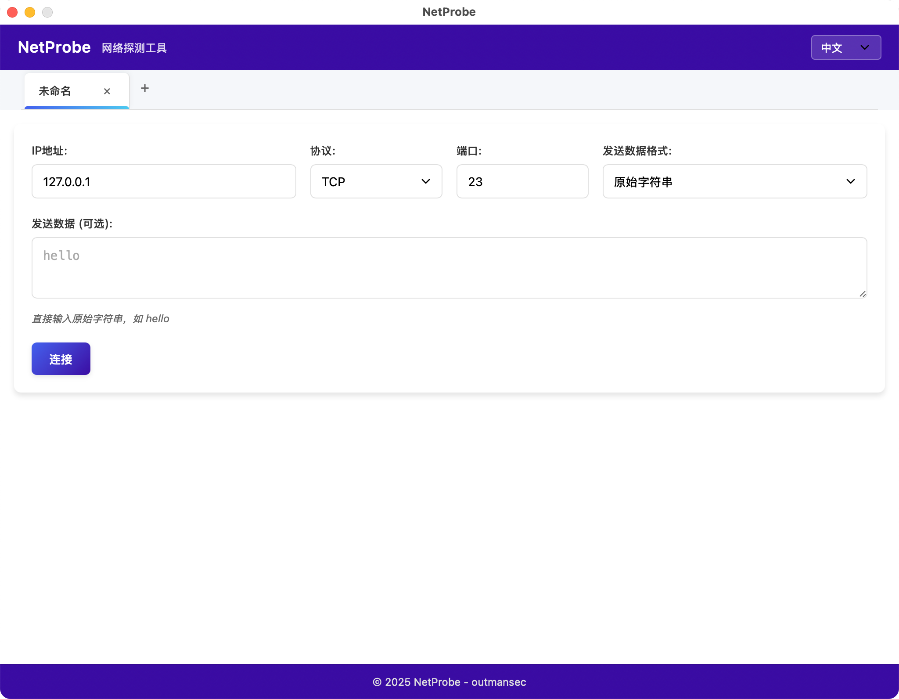
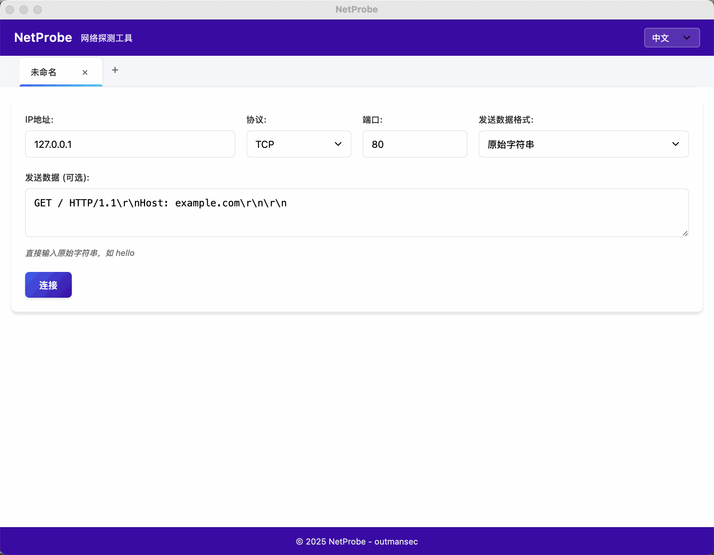
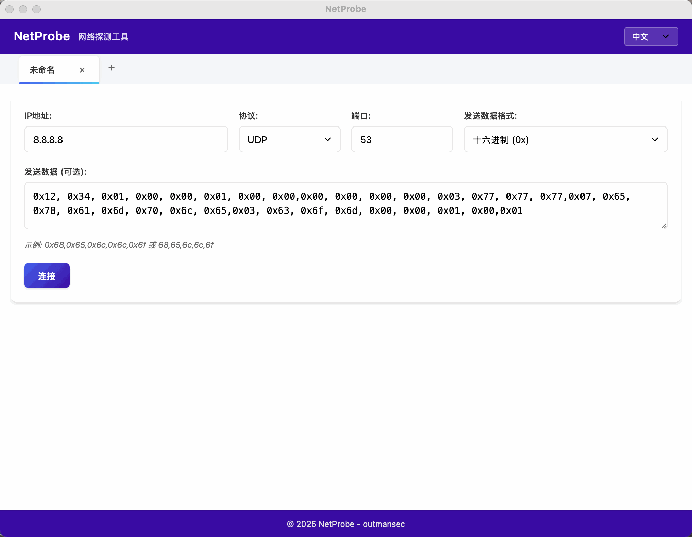

<div align="center">
  <h1>🌐 NetProbe</h1>
</div>

<div align="center">


</div>

<div align="center">
  <h3>一个基于Go和Wails框架开发的现代化、跨平台网络探测工具，支持TCP和UDP协议，提供友好的图形用户界面。</h3>
</div>

<div align="center">
  
</div>

<div align="center">
  <a href="README_EN.md">English README</a> | <b>中文说明</b>
</div>

---

## ✨ 功能特点

- **🔌 多协议支持**：同时支持TCP和UDP协议
- **📊 多种数据格式**：
  - 原始字符串
  - 十六进制(0x格式)：如 `0x68,0x65,0x6c,0x6c,0x6f`
  - 十六进制(\x格式)：如 `\x68\x65\x6c\x6c\x6f`
- **🔄 多格式数据显示**：
  - 十六进制(0x格式)
  - 十六进制(\x格式)
  - 十进制
  - 原始字符串
- **📑 多标签页支持**：可同时打开多个连接会话
- **🌐 多语言支持**：支持中文和英文界面
- **🔒 安全性**：防XSS攻击，安全显示接收到的数据
- **💻 跨平台**：支持Windows、macOS和Linux
- **🎨 现代化界面**：简洁直观的用户界面，支持深色/浅色主题

## 📥 安装

### 预编译版本

从[Releases](https://github.com/outmansec/NetProbe/releases)页面下载适合您操作系统的预编译版本。

### 从源码构建

#### 前提条件

- Go 1.21或更高版本
- Wails CLI v2.6.0或更高版本

```bash
# 安装Wails CLI
go install github.com/wailsapp/wails/v2/cmd/wails@latest

# 克隆仓库
git clone https://github.com/outmansec/NetProbe.git
cd NetProbe

# 构建应用
wails build
```

## 🚀 使用方法

1. 启动应用程序
2. 输入目标IP地址和端口
3. 选择协议(TCP或UDP)
4. 选择发送数据格式(原始字符串、十六进制0x格式或十六进制\x格式)
5. 输入要发送的数据(可选)
6. 点击"连接"按钮

## 📝 示例

### TCP连接示例

<div align="center">

| 参数 | 值 |
|:------:|:-----:|
| IP地址 | `127.0.0.1` |
| 端口 | `80` |
| 协议 | `TCP` |
| 发送数据格式 | `原始字符串` |
| 发送数据 | `GET / HTTP/1.1\r\nHost: example.com\r\n\r\n` |

</div>

<div align="center">
  
</div>

### UDP连接示例

<div align="center">

| 参数 | 值 |
|:------:|:-----:|
| IP地址 | `8.8.8.8` |
| 端口 | `53` |
| 协议 | `UDP` |
| 发送数据格式 | `十六进制(0x格式)` |
| 发送数据 | `0x12, 0x34, 0x01, 0x00, 0x00, 0x01, 0x00, 0x00,0x00, 0x00, 0x00, 0x00, 0x03, 0x77, 0x77, 0x77,0x07, 0x65, 0x78, 0x61, 0x6d, 0x70, 0x6c, 0x65,0x03, 0x63, 0x6f, 0x6d, 0x00, 0x00, 0x01, 0x00,0x01` |

</div>

<div align="center">
  
</div>

## 🛠️ 开发

### 项目结构

```
NetProbe/
├── app.go                # 应用程序逻辑
├── main.go               # 主程序入口
├── frontend/             # 前端资源
│   ├── dist/             # 编译后的前端文件
│   │   ├── index.html    # HTML主文件
│   │   ├── app.js        # JavaScript逻辑
│   │   ├── styles.css    # CSS样式
│   │   └── i18n/         # 国际化翻译文件
│   │       ├── zh-CN.json  # 中文翻译
│   │       └── en-US.json  # 英文翻译
│   └── wailsjs/          # Wails生成的JS绑定
├── build/                # 构建输出目录
├── screenshots/          # 截图目录
│   ├── zh-CN.png         # 中文界面截图
│   └── en-US.png         # 英文界面截图
└── wails.json            # Wails配置文件
```

### 技术栈

- **后端**: Go语言
- **前端**: HTML, CSS, JavaScript
- **框架**: Wails (Go与Web技术的桥接)
- **国际化**: 支持多语言（中文、英文）

## 👥 贡献

欢迎提交问题和Pull Request！

## 📄 许可证

本项目采用MIT许可证 - 详见[LICENSE](LICENSE)文件

## 🙏 致谢

- [Wails](https://wails.io/) - 提供Go与Web技术的桥接框架
- [outmansec](https://github.com/outmansec) - 项目作者
- [Claude AI](https://www.anthropic.com/claude) - 部分代码由Claude AI辅助完成

## 📞 联系方式

如有问题或建议，请通过GitHub Issues联系我们。

## 📝 更新日志

### v1.0.0 (2025-07-22)
- 初始版本发布
- 支持TCP和UDP协议
- 支持多种数据格式
- 多语言支持（中文、英文）
- 多标签页支持

---

<div align="center">
  © 2025 NetProbe - outmansec
</div>