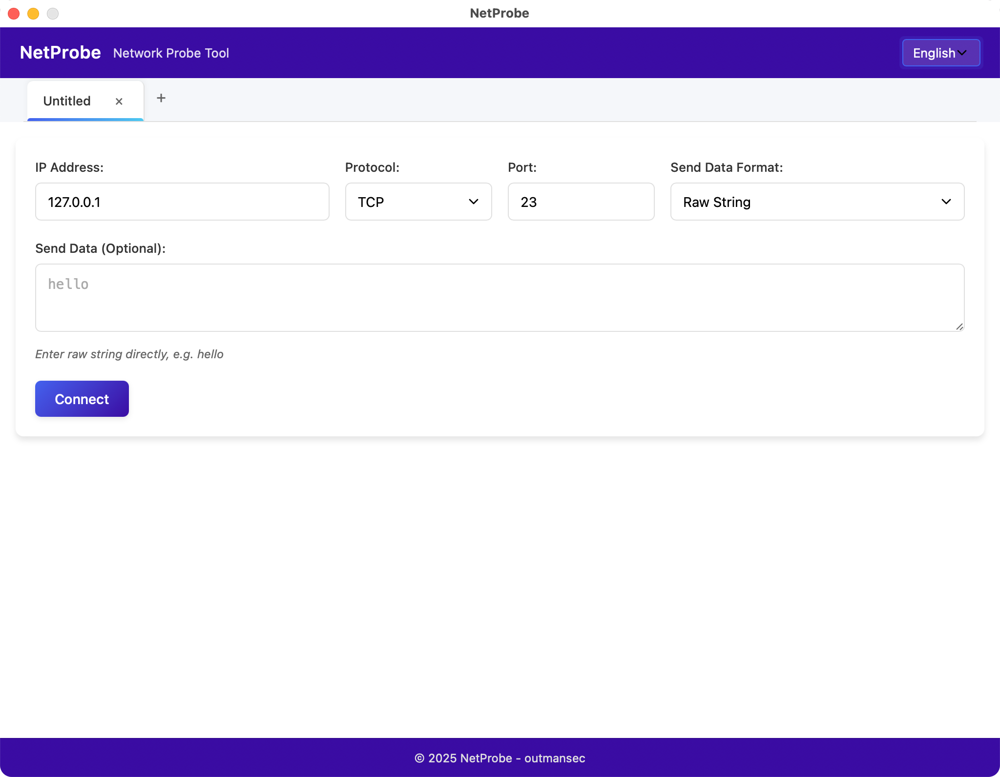
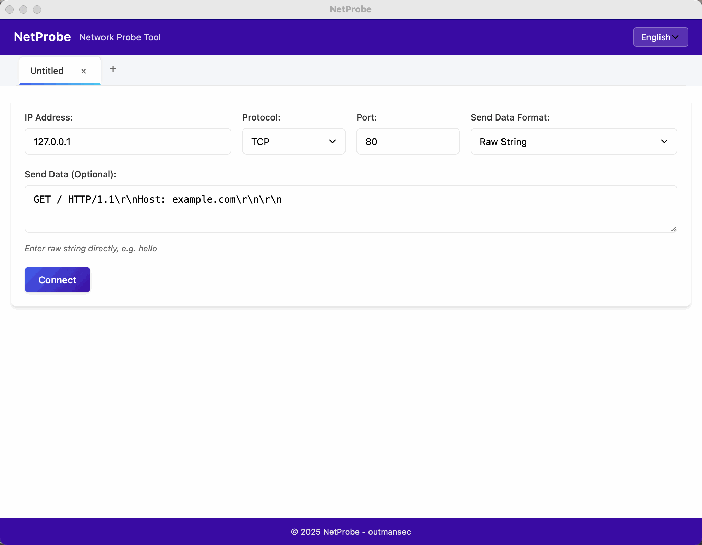
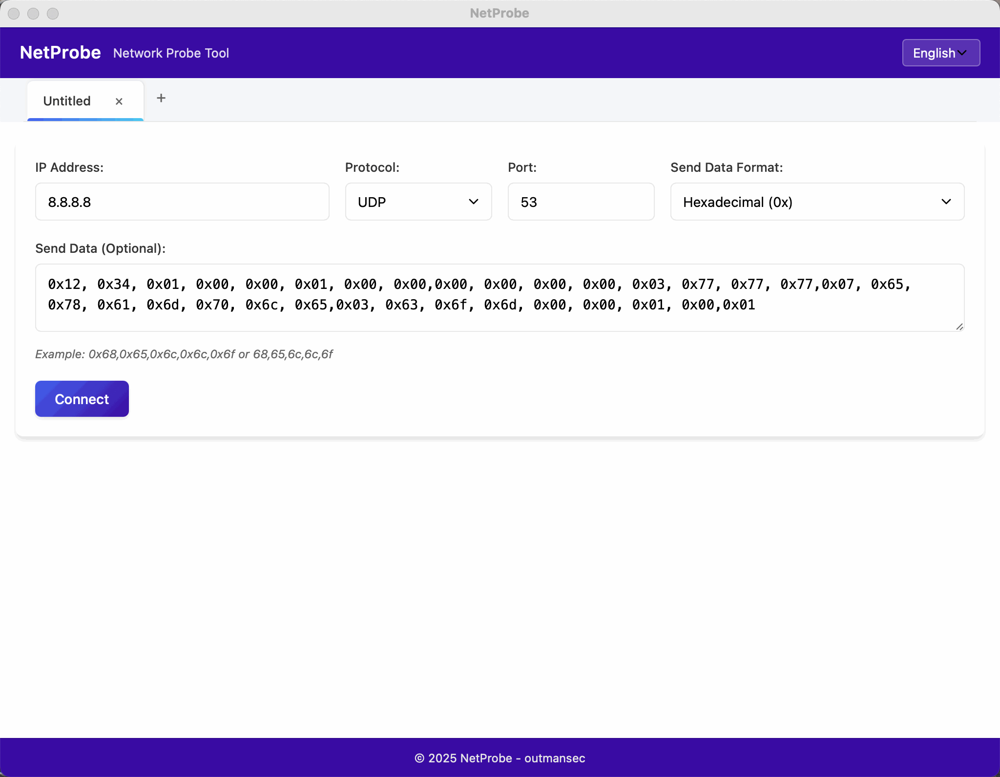

<div align="center">
  <h1>🌐 NetProbe</h1>
</div>

<div align="center">


</div>

<div align="center">
  <h3>A modern, cross-platform network probe tool based on Go and Wails framework, supporting TCP and UDP protocols with a user-friendly graphical interface.</h3>
</div>

<div align="center">
  
</div>

<div align="center">
  <a href="README.md">中文说明</a> | <b>English README</b>
</div>

---

## ✨ Features

- **🔌 Multi-protocol Support**: Supports both TCP and UDP protocols
- **📊 Multiple Data Formats**:
  - Raw string
  - Hexadecimal (0x format): e.g., `0x68,0x65,0x6c,0x6c,0x6f`
  - Hexadecimal (\x format): e.g., `\x68\x65\x6c\x6c\x6f`
- **🔄 Multiple Data Display Formats**:
  - Hexadecimal (0x format)
  - Hexadecimal (\x format)
  - Decimal
  - Raw string
- **📑 Multi-tab Support**: Open multiple connection sessions simultaneously
- **🌐 Multilingual Support**: Chinese and English interfaces
- **🔒 Security**: XSS attack prevention, secure display of received data
- **💻 Cross-platform**: Supports Windows, macOS, and Linux
- **🎨 Modern Interface**: Clean and intuitive user interface with light/dark theme support

## 📥 Installation

### Pre-compiled Versions

Download the pre-compiled version for your operating system from the [Releases](https://github.com/outmansec/NetProbe/releases) page.

### Build from Source

#### Prerequisites

- Go 1.21 or higher
- Wails CLI v2.6.0 or higher

```bash
# Install Wails CLI
go install github.com/wailsapp/wails/v2/cmd/wails@latest

# Clone repository
git clone https://github.com/outmansec/NetProbe.git
cd NetProbe

# Build application
wails build
```

## 🚀 Usage

1. Launch the application
2. Enter the target IP address and port
3. Select protocol (TCP or UDP)
4. Choose data format (Raw string, Hexadecimal 0x format, or Hexadecimal \x format)
5. Enter data to send (optional)
6. Click the "Connect" button

## 📝 Examples

### TCP Connection Example

<div align="center">

| Parameter | Value |
|:-----------:|:-------:|
| IP Address | `127.0.0.1` |
| Port | `80` |
| Protocol | `TCP` |
| Data Format | `Raw string` |
| Data to Send | `GET / HTTP/1.1\r\nHost: example.com\r\n\r\n` |

</div>

<div align="center">
  
</div>

### UDP Connection Example

<div align="center">

| Parameter | Value |
|:-----------:|:-------:|
| IP Address | `8.8.8.8` |
| Port | `53` |
| Protocol | `UDP` |
| Data Format | `Hexadecimal (0x format)` |
| Data to Send | `0x12, 0x34, 0x01, 0x00, 0x00, 0x01, 0x00, 0x00,0x00, 0x00, 0x00, 0x00, 0x03, 0x77, 0x77, 0x77,0x07, 0x65, 0x78, 0x61, 0x6d, 0x70, 0x6c, 0x65,0x03, 0x63, 0x6f, 0x6d, 0x00, 0x00, 0x01, 0x00,0x01` |

</div>

<div align="center">
  
</div>

## 🛠️ Development

### Project Structure

```
NetProbe/
├── app.go                # Application logic
├── main.go               # Main program entry
├── frontend/             # Frontend resources
│   ├── dist/             # Compiled frontend files
│   │   ├── index.html    # HTML main file
│   │   ├── app.js        # JavaScript logic
│   │   ├── styles.css    # CSS styles
│   │   └── i18n/         # Internationalization files
│   │       ├── zh-CN.json  # Chinese translations
│   │       └── en-US.json  # English translations
│   └── wailsjs/          # Wails generated JS bindings
├── build/                # Build output directory
├── screenshots/          # Screenshots directory
│   ├── zh-CN.png         # Chinese interface screenshot
│   └── en-US.png         # English interface screenshot
└── wails.json            # Wails configuration file
```

### Technology Stack

- **Backend**: Go language
- **Frontend**: HTML, CSS, JavaScript
- **Framework**: Wails (Bridge between Go and Web technologies)
- **Internationalization**: Multi-language support (Chinese, English)

## 👥 Contributing

Contributions are welcome! Feel free to submit issues and pull requests.

## 📄 License

This project is licensed under the MIT License - see the [LICENSE](LICENSE) file for details.

## 🙏 Acknowledgments

- [Wails](https://wails.io/) - Provides the bridge between Go and Web technologies
- [outmansec](https://github.com/outmansec) - Project author
- [Claude AI](https://www.anthropic.com/claude) - Portions of the code were assisted by Claude AI

## 📞 Contact

For questions or suggestions, please contact us through GitHub Issues.

## 📝 Changelog

### v1.0.0 (2025-07-22)
- Initial release
- Support for TCP and UDP protocols
- Multiple data format support
- Multi-language support (Chinese, English)
- Multi-tab support

---

<div align="center">
  © 2025 NetProbe - outmansec
</div>